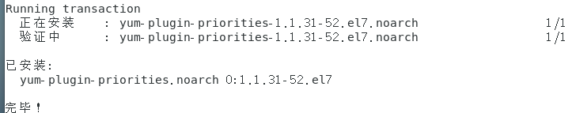
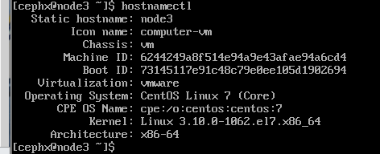
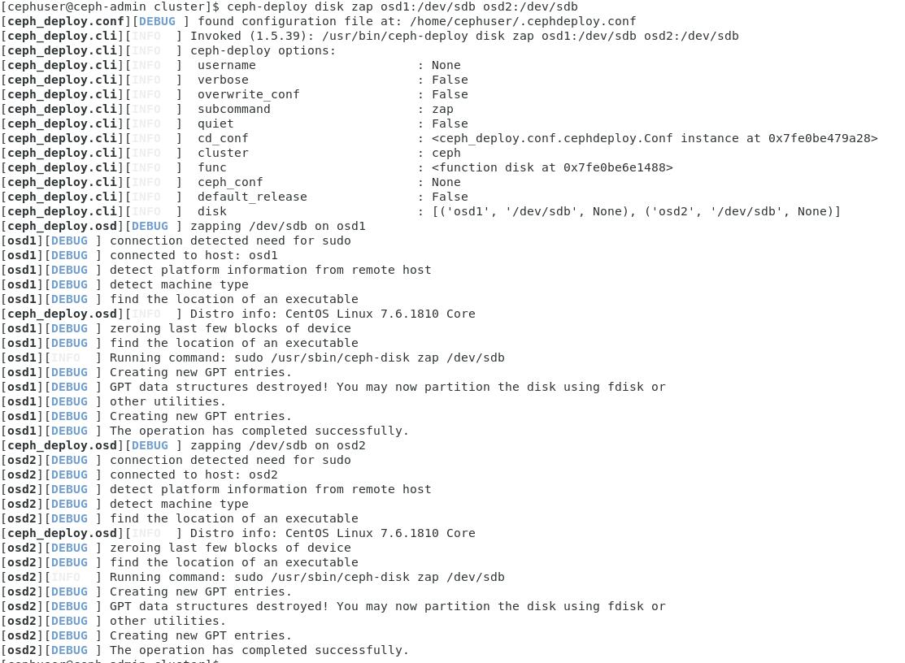

# 在Centos上安装Ceph


## 预设置

#### 安装rpm管理工具

​	在 CentOS 上，可以执行下列命令：

```
sudo yum install -y yum-utils && sudo yum-config-manager --add-repo https://dl.fedoraproject.org/pub/epel/7/x86_64/ && sudo yum install --nogpgcheck -y epel-release && sudo rpm --import /etc/pki/rpm-gpg/RPM-GPG-KEY-EPEL-7 && sudo rm /etc/yum.repos.d/dl.fedoraproject.org*
```

​	把软件包源加入软件仓库。用文本编辑器创建一个 YUM (Yellowdog Updater, Modified) 库文件，其路径为 `/etc/yum.repos.d/ceph.repo` 

```
sudo vim /etc/yum.repos.d/ceph.repo
```

​	把如下内容粘帖进去，用 Ceph 的最新主稳定版名字替换 `{ceph-stable-release}` （如 `firefly` ），用你的Linux发行版名字替换 `{distro}` （如 `el6` 为 CentOS 6 、 `el7` 为 CentOS 7 、 `rhel6` 为 Red Hat 6.5 、 `rhel7` 为 Red Hat 7 、 `fc19` 是 Fedora 19 、 `fc20` 是 Fedora 20 ）。最后保存到 `/etc/yum.repos.d/ceph.repo` 文件中。

```
[ceph-noarch]
name=Ceph noarch packages
baseurl=https://mirrors.aliyun.com/ceph/rpm-jewel/el7/noarch/
enabled=1
gpgcheck=1
type=rpm-md
gpgkey=https://mirrors.aliyun.com/ceph/keys/release.asc
```

​	更新软件库并安装 `ceph-deploy` ：

```
sudo yum update && sudo yum install ceph-deploy
```

#### 安装NTP协议

安装NTP以同步所有节点上的日期和时间。运行ntpdate命令通过NTP协议设置日期和时间，我们将使用US池NTP服务器。然后启动并启用NTP服务器在启动时运行。

```
sudo yum install ntp ntpdate ntp-doc
ntpdate 0.us.pool.ntp.org
hwclock --systohc
systemctl enable ntpd.service
systemctl start ntpd.service
```


#### 安装SSH

因本CentOS镜像自带，略过

#### 创建部署CEPH的用户

1. 在各 Ceph 节点创建新用户。

   ```
   ssh user@ceph-server
   sudo useradd -d /home/{username} -m {username}
   sudo passwd {username}
   ```

2. 确保各 Ceph 节点上新创建的用户都有 `sudo` 权限。

   ```
   echo "{username} ALL = (root) NOPASSWD:ALL" | sudo tee /etc/sudoers.d/{username}
   sudo chmod 0440 /etc/sudoers.d/{username}
   ```

#### 允许无密码 SSH 登录

正因为 `ceph-deploy` 不支持输入密码，你必须在管理节点上生成 SSH 密钥并把其公钥分发到各 Ceph 节点。 `ceph-deploy` 会尝试给初始 monitors 生成 SSH 密钥对。

1. 生成 SSH 密钥对，但不要用 `sudo` 或 `root` 用户。提示 “Enter passphrase” 时，直接回车，口令即为空：

   ```
   ssh-keygen
   ```

2. 把公钥拷贝到各 Ceph 节点，把下列命令中的 `{username}` 替换成前面[创建部署 Ceph 的用户](http://docs.ceph.org.cn/start/quick-start-preflight/#id3)里的用户名。

   ```
   ssh-copy-id mon
   ssh-copy-id node2
   ssh-copy-id node3
   ```

3. 修改 `ceph-deploy` 管理节点上的 `~/.ssh/config` 文件，这样 `ceph-deploy` 就能用你所建的用户名登录 Ceph 节点了，而无需每次执行 `ceph-deploy` 都要指定 `--username {username}` 。这样做同时也简化了 `ssh` 和 `scp` 的用法。把 `{username}` 替换成你创建的用户名。

   ```
   Host node1
      Hostname mon
      User cephx
   Host node2
      Hostname node2
      User cephx
   Host node3
      Hostname node3
      User	cephx
   ```


#### 安装yum-plugin-priorities



#### 设置防火墙开放端口


#### 禁用SELINUEX

在 CentOS 和 RHEL 上， SELinux 默认为 `Enforcing` 开启状态。为简化安装，我们建议把 SELinux 设置为 `Permissive` 或者完全禁用，也就是在加固系统配置前先确保集群的安装、配置没问题。用下列命令把 SELinux 设置为 `Permissive` ：

```
sudo setenforce 0
```

要使 SELinux 配置永久生效（如果它的确是问题根源），需修改其配置文件 `/etc/selinux/config` 。

#### 设置主机名、hosts

将各机的地址配置到ceph-deploy机下的/etc/hosts文件中

```
使用 hostname set-hostname {hostname} 修改主机名
```




## 配置存储集群

### 创建新磁盘分区

使用fdisk命令检查分区。

```
sudo fdisk -l /dev/sdb
```

使用Parted命令用XFS文件系统和GPT分区表格式化/dev/sdb分区。

```
sudo parted -s /dev/sdb mklabel gpt mkpart primary xfs 0% 100%
sudo mkfs.xfs /dev/sdb -f
```

现在检查分区，您将得到XFS/dev/sdb分区。

```
sudo blkid -o value -s TYPE /dev/sdb
```


#### 创建集群。

创建文件夹

```
mkdir my-cluster
cd my-cluster
```

`ceph-deploy` 会把文件输出到当前目录，所以请确保在此目录下执行 `ceph-deploy` 。


```
ceph-deploy new mon
```


#### 修改配置文件

1. 把 Ceph 配置文件里的默认副本数从 `3` 改成 `2` ，这样只有两个 OSD 也可以达到 `active + clean` 状态。把下面这行加入 `[global]` 段：

   ```
   osd pool default size = 2
   ```

2. 如果你有多个网卡，可以把 `public network` 写入 Ceph 配置文件的 `[global]` 段下。详情见[网络配置参考](http://docs.ceph.org.cn/rados/configuration/network-config-ref)。

   ```
   public network = {ip-address}/{netmask}
   ```


#### 安装 Ceph 。

```
ceph-deploy install mon node2 node3
```


配置初始 monitor(s)、并收集所有密钥：

```
ceph-deploy mon create-initial
```


#### 添加OSDS


1.添加两个 OSD 。为了快速地安装，这篇快速入门把目录而非整个硬盘用于 OSD 守护进程。如何为 OSD 及其日志使用独立硬盘或分区，请参考 [ceph-deploy osd](http://docs.ceph.org.cn/rados/deployment/ceph-deploy-osd) 。登录到 Ceph 节点、并给 OSD 守护进程创建一个目录。

```
ssh node2
sudo mkdir /var/local/osd0
exit

ssh node3
sudo mkdir /var/local/osd1
exit
```


检查/dev/sdb分区在所有OSD节点上是否可用。

```
ceph-deploy disk list osd1 osd2
```


您将看到XFS格式的/dev/sdb磁盘。

接下来，使用zap选项删除所有节点上的/dev/sdb分区表。

```
ceph-deploy disk zap osd1:/dev/sdb osd2:/dev/sdb
```



该命令将删除CephOSD节点上/dev/sdb上的所有数据。

现在准备好所有OSDS节点。确保结果中没有错误。

然后，从管理节点执行 `ceph-deploy` 来准备 OSD 。

```
ceph-deploy osd prepare node2:/var/local/osd0 node3:/var/local/osd1
```


如果您看到osd 1-2已经为OSD使用结果做好了准备，那么部署就成功了。

最后，激活 OSD 

```
ceph-deploy osd activate node2:/var/local/osd0 node3:/var/local/osd1
```


在继续之前，请检查输出中是否有错误。现在，您可以使用List命令检查OSD节点上的SDB磁盘。

2.用 `ceph-deploy` 把配置文件和 admin 密钥拷贝到管理节点和 Ceph 节点，这样你每次执行 Ceph 命令行时就无需指定 monitor 地址和 `ceph.client.admin.keyring` 了。

```
ceph-deploy admin admin-node node1 node2 node3
```

`ceph-deploy` 和本地管理主机（ `admin-node` ）通信时，必须通过主机名可达。必要时可修改 `/etc/hosts` ，加入管理主机的名字。

3.确保你对 `ceph.client.admin.keyring` 有正确的操作权限。

```
sudo chmod +r /etc/ceph/ceph.client.admin.keyring
```

检查集群的健康状况。

```
ceph health
```


可见，集群已成功创建并达到active+clean状态