# Centos7 Docker install


## step 1 先置配置


查看内核版本


**添加用户到wheel组中（默认拥有sudo权限）**


## 安装Docker

**更新yum程序数据库**


**安装Docker依赖**


**设置阿里云镜像**


**安装Docker-ce**


**启动Docker**


**查看运行状态**

```
sudo systemctl status docker
```


**设置开机启动**

```
sudo systemctl enable docker
```


**查看Docker版本信息**

```
sudo docker version
```


[^错误提醒]: 不加sudo会有些权限无法显示


## 加载Docker镜像


## 运行Docker容器


  - ```
    Failed to synchronize cache for repo 'BaseOS', ignoring this repo.
    Error: 
      Problem: conflicting requests
    
    - nothing provides /etc/mime.types needed by httpd-2.4.37-12.module_el8.0.0+185+5908b0db.x86_64
    - nothing provides libbrotlienc.so.1()(64bit) needed by httpd-2.4.37-12.module_el8.0.0+185+5908b0db.x86_64
      (try to add '--skip-broken' to skip uninstallable packages or '--nobest' to use not only best candidate packages)
    ```


设置开机启动


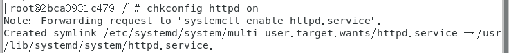

## 创建新的镜像

退出当前容器


查看本地容器

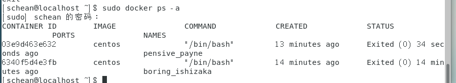


创建一个新的容器


 sudo docker commit -m "add apache web" -a “ll” 03e9d463e632 test_repository/centos-apache-web


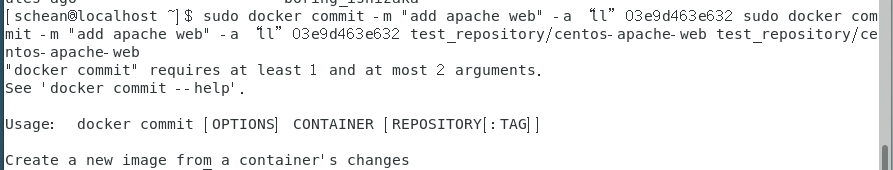


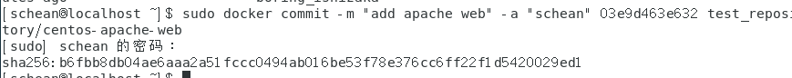


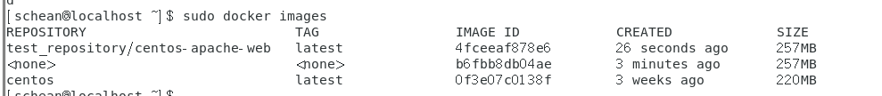


更改tag

sudo docker tag [your container's IMAGE ID] [docker-hub-user-name]/[repository-name]:[TAG]


## 推送到远程仓库

docker login -u [docker-username]


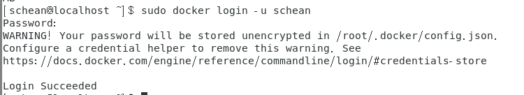


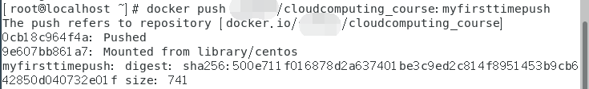

sudo docker push [Repository] :[tag]


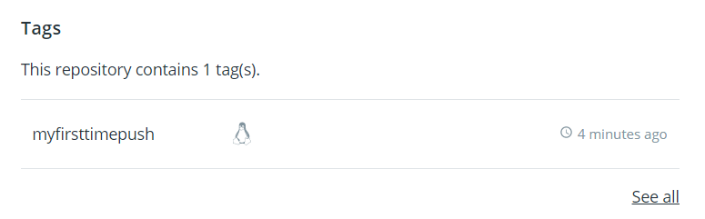


## 在容器中安装Wordpress

打开安装了httpd的容器


systemctl start httpd.service


 System has not been booted with systemd as init system (PID 1). Can't operate. Failed to conn


sudo docker run -it -p 2222:22 -p 8888:80 4fceeaf878e6 /bin/bash


sudo docker run -d -it --privileged --name wordpress -p 8888:80 -d 4fceeaf878e6 /usr/sbin/init


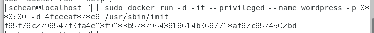

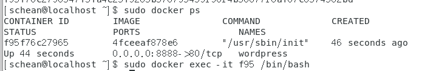

安装mysql


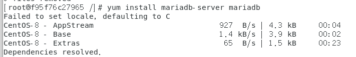


安装php

 yum install epel-release yum-utils
 yum install http://rpms.remirepo.net/enterprise/remi-release-7.rpm

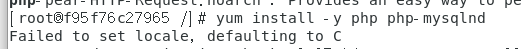


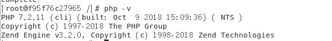

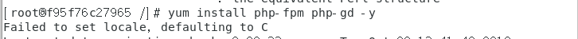


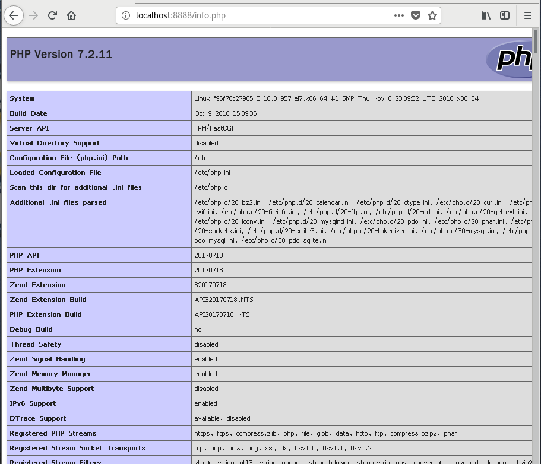


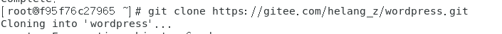


容器里无wget，无git，无rsync工具，需手动下载（centos8版本）


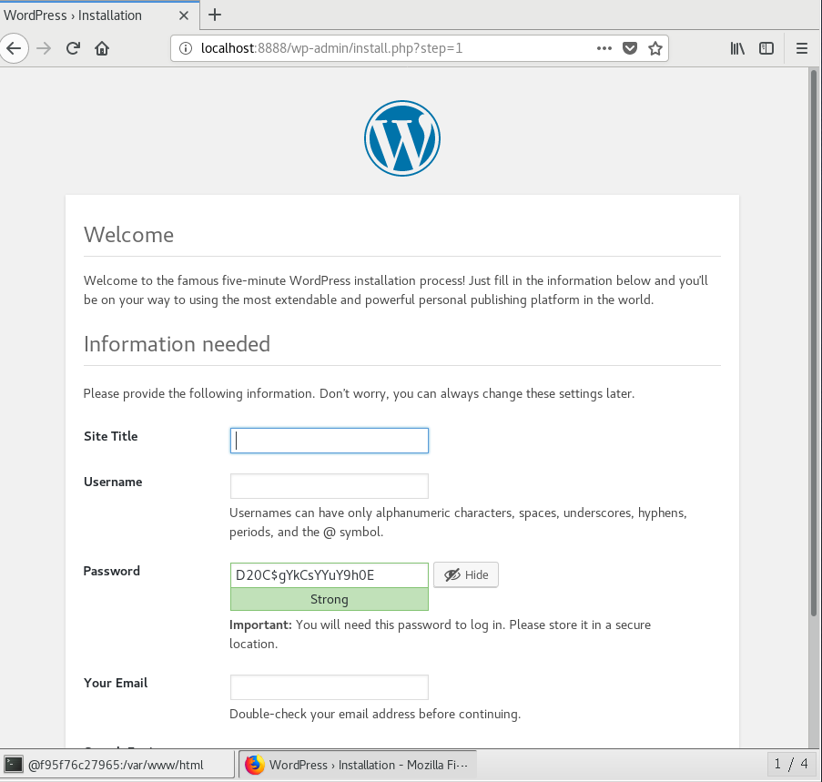


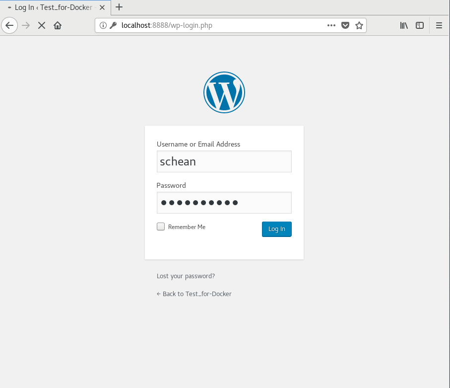


提交带有wordpress的容器

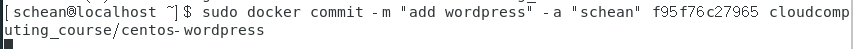


更改tag

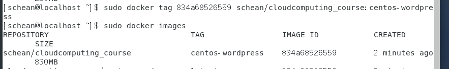


### 推送到远程仓库


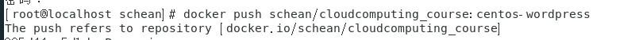