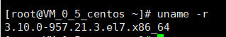
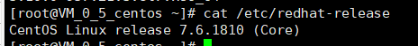
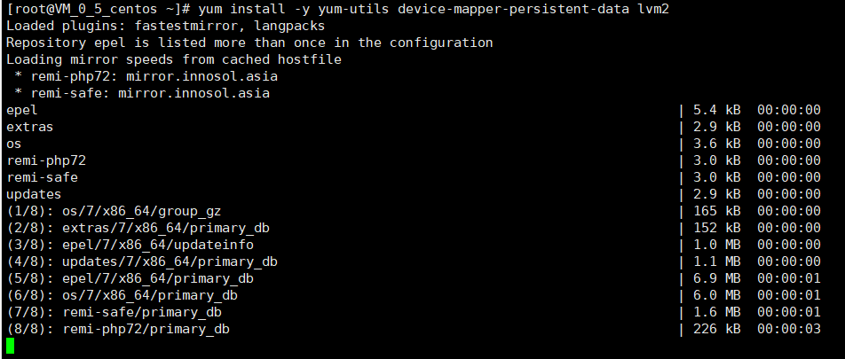
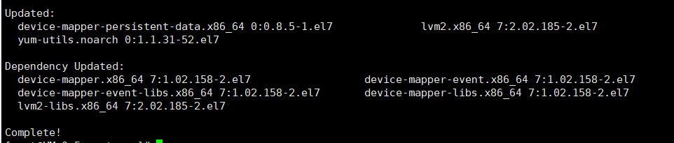
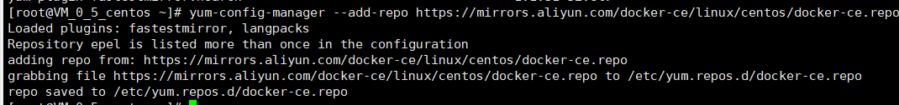
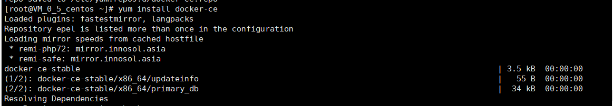
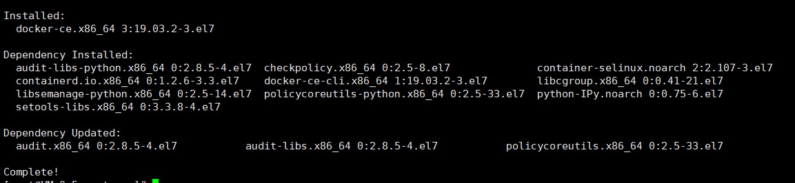
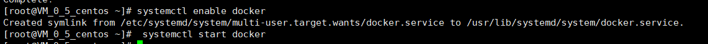
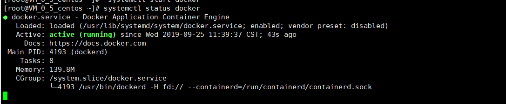
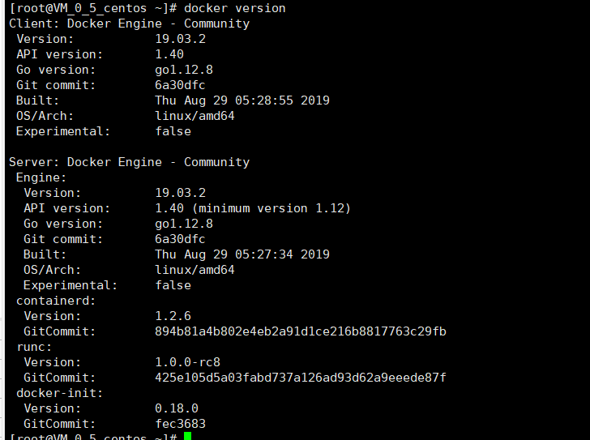

# CentOS 7安装Docker

- 已安装CentOS 7，并且内核版本大等于3.10，本文使用的是阿里云的镜像：[CentOS镜像](http://mirrors.aliyun.com/centos/7/isos/x86_64/)。
- 非root用户已获得sudo特权。

使用如下命令查看操作系统内核信息：

```
uname -r
```

结果如图所示：



顺带看一下Linux的版本号：

```
cat /etc/redhat-release

```

结果如图所示




安装Docker依赖包

```
yum install -y yum-utils device-mapper-persistent-data lvm2 
```






设置阿里云镜像

```
 yum-config-manager --add-repo https://mirrors.aliyun.com/docker-ce/linux/centos/docker-ce.repo 
```




### 安装 Docker-CE

```
yum install docker-ce
```






安装完成之后设置开机启动并启动Docker守护进程，即Docker服务：

```
systemctl enable docker
 systemctl start docker
```




验证Docker是否成功启动：

```
sudo systemctl status docker
```




此外，还可以查看一下Docker的版本信息：

```
docker version

```

输出如图：

