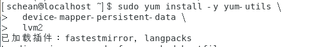
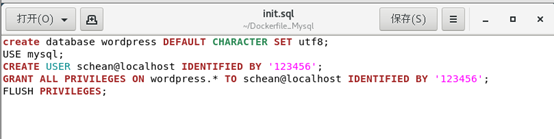

# CentOS 7安装Docker

- 已安装CentOS 7，并且内核版本大等于3.10，本文使用的是阿里云的镜像：[CentOS镜像](http://mirrors.aliyun.com/centos/7/isos/x86_64/)。
- 非root用户已获得sudo特权。

使用如下命令查看操作系统内核信息：

```
uname -r
```

结果如图所示：


顺带看一下Linux的版本号：

```
cat /etc/redhat-release

```

结果如图所示


安装Docker依赖包

```
yum install -y yum-utils device-mapper-persistent-data lvm2 
```




设置阿里云镜像

```
 yum-config-manager --add-repo https://mirrors.aliyun.com/docker-ce/linux/centos/docker-ce.repo 
```


## 安装 Docker-CE

```
yum install docker-ce
```


安装完成之后设置开机启动并启动Docker守护进程，即Docker服务：

```
systemctl enable docker
 systemctl start docker
```


验证Docker是否成功启动：

```
sudo systemctl status docker
```


此外，还可以查看一下Docker的版本信息：

```
docker version
```

输出如图：


## 加载Docker镜像

 将从Docker Hub拉取镜像。首先使用search命令查询Docker Hub中的可用centos镜像，


 接下来拉取官方版本(OFFICIAL)的镜像： 


 一旦镜像下载完成，可以基于该镜像运行容器，使用run命令：

```
docker run [image name]
```

 


 查看一下当前系统中存在的镜像： 

```
docker images
```


## 运行Docker容器

由于要安装apache web服务器

先通过privileged模式获得使用systemctl命令的权限，再开启8888端口对80端口的映射已便之后能打开网页

```
sudo docker run -dit --privileged --name wordpress -p 8888:80 -d 4fceeaf878e6 /usr/sbin/init
-it for terminal 
```


确认映射成功并打开容器

```
docker ps
docker exec -it [CONTAINER ID] bash
```


安装apache web服务器（出现‘/’说明进入容器中运行）


设置开机启动


安装mysql


安装php

```
 yum install epel-release yum-utils
 yum install http://rpms.remirepo.net/enterprise/remi-release-7.rpm
 sudo yum-config-manager --enable remi-php72
 sudo yum install php php-mysql
```


查看php版本


测试PHP
这里我们利用一个简单的信息显示页面（info.php）测试PHP。创建info.php并将其置于Web服务的根目录（/var/www/html/）：

```
sudo vim /var/www/html/info.php
```


该命令使用vim在/var/www/html/处创建一个空白文件info.php，我们添加如下内容：

<?php phpinfo(); ?>

完成之后，使用刚才获取的cvm的IP地址，在你的本地主机的浏览器中输入:

http://your_cvm_ip/info.php


安装wordpress


## 提交带有wordpress的容器

由于Dockhub仓库位于境外，出口上行带宽较小，因而选择国内的仓库

登陆到远程仓库


提交到本地仓库

```
docker commit [OPTIONS] CONTAINER [REPOSITORY[:TAG]]
```


更改tag

```
docker tag [image id] [remoterepository/username/imagename]:[tag]
```


## 推送到远程仓库

```
docker push [remoterepository/username/imagename]:[tag]
```


# 使用Dockerfile安装wordpress

## 安装apache web服务器

### Dockerfile内容：


​	以centos的原始镜像为基础镜像，开放80端口，设置/root为工作目录；

​	通过yum下载apache web服务器，通过echo命令把文本添加到apache服务器的工作目录下的index文件中

```
通过 docker build -f ./Dockefile . -t test/apache:file[repositoryID:tag]
	使用dockerfile构建镜像  
通过 docker run -d -it --privileged -p 8888：80  -d  [image ID]  /usr/sbin/init
	docker exec -it [image ID] /bin/bash
	创建使用8888端口映射80端口的容器并打开容器
```

在主机上通过浏览器访问，验证安装是否成功


## 安装MySQL

### Dockerfile内容：


以之前创建的带有apache服务器的镜像为基础镜像，开放80和3306端口，以/root为工作目录；

通过curl配置阿里云yum源，安装MariaDb和MariaDBserver

把创建好的setroot.sql（设置root账户）、init.sql（创建wordpress账户和数据库）、server.cnf、setup_mysqld.sh（安装脚本）添加到镜像中指定的位置并修改脚本的权限。

因为镜像中的在/usr/bin/resolveip命令在/usr/libexec文件夹中没有链接，需要手动创建，否则在setup_mysqld.sh脚本中的mysql_install_db命令会因为无法调用resolveip命令报错终止

### 文件内容如下：





打开mariadb验证脚本输出结果


## 安装PHP

Dockerfile文件：


通过yum下载epel源与remi源，启用remi仓库后安装php7与php-mysql与php模块=

创建info.php文件来验证是否安装成功


## 安装wordpress


Dockerfile文件：


配置wp-config.php


打开http://server_domain_name_or_IP/wp-admin

进行安装


安装过程见文档Centos下安装wordpress


安装完毕将镜像上传至远程仓库


