# 使用Dockerfile安装wordpress

## 安装apache web服务器

### Dockerfile内容：

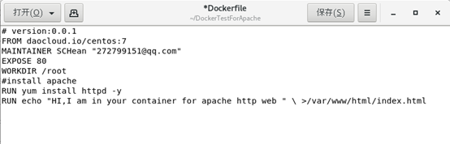

​	以centos的原始镜像为基础镜像，开放80端口，设置/root为工作目录；

​	通过yum下载apache web服务器，通过echo命令把文本添加到apache服务器的工作目录下的index文件中

```
通过 docker build -f ./Dockefile . -t test/apache:file[repositoryID:tag]
	使用dockerfile构建镜像  
通过 docker run -d -it --privileged -p 8888：80  -d  [image ID]  /usr/sbin/init
	docker exec -it [image ID] /bin/bash
	创建使用8888端口映射80端口的容器并打开容器
```

在主机上通过浏览器访问，验证安装是否成功

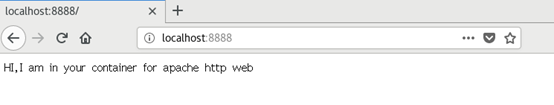


## 安装MySQL

### Dockerfile内容：


以之前创建的带有apache服务器的镜像为基础镜像，开放80和3306端口，以/root为工作目录；

通过curl配置阿里云yum源，安装MariaDb和MariaDBserver

把创建好的setroot.sql（设置root账户）、init.sql（创建wordpress账户和数据库）、server.cnf、setup_mysqld.sh（安装脚本）添加到镜像中指定的位置并修改脚本的权限。

因为镜像中的在/usr/bin/resolveip命令在/usr/libexec文件夹中没有链接，需要手动创建，否则在setup_mysqld.sh脚本中的mysql_install_db命令会因为无法调用resolveip命令报错终止

### 文件内容如下：

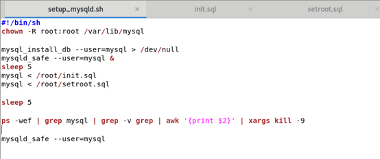

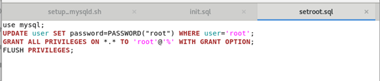

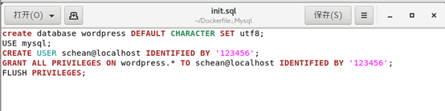


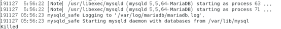

打开mariadb验证脚本输出结果

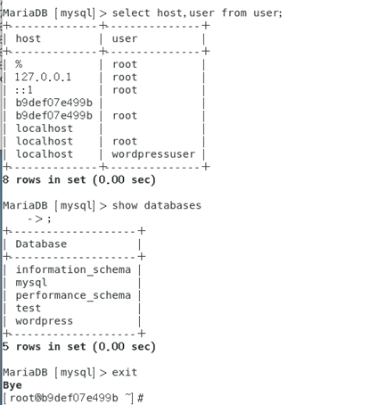

## 安装PHP

Dockerfile文件：

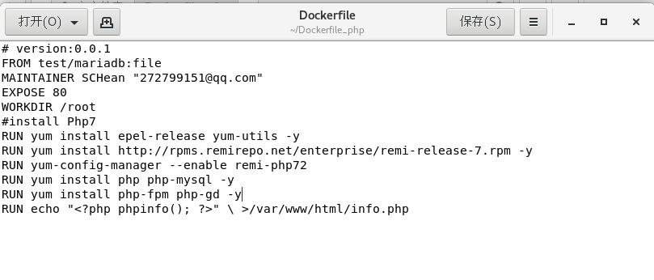

通过yum下载epel源与remi源，启用remi仓库后安装php7与php-mysql与php模块

创建info.php文件来验证是否安装成功

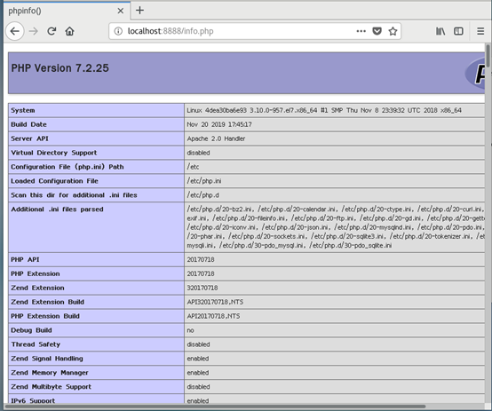


## 安装wordpress


Dockerfile文件：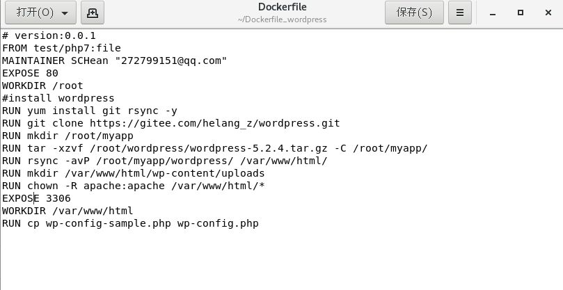


配置wp-config.php

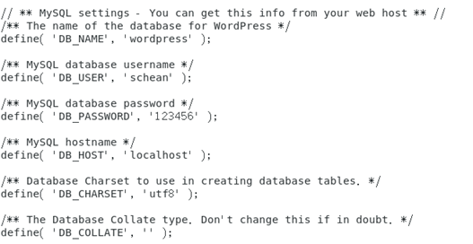


打开http://server_domain_name_or_IP/wp-admin

进行安装

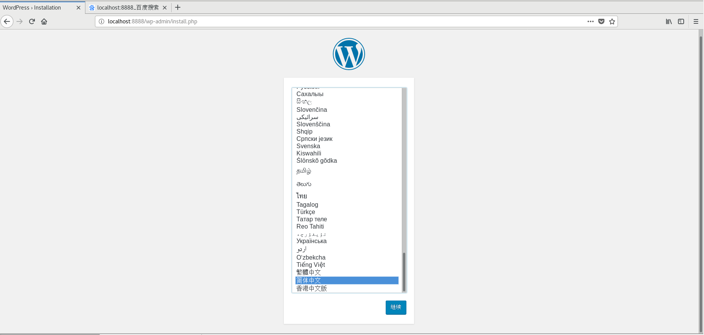

安装过程见文档Centos下安装wordpress


安装完毕将镜像上传至远程仓库

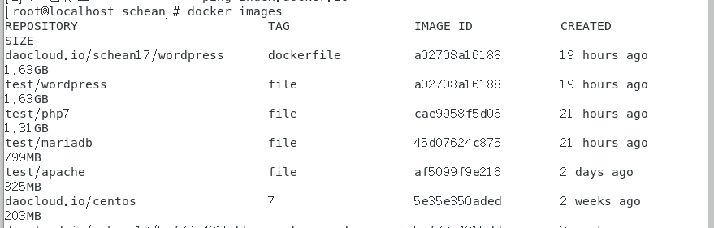

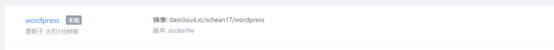