# 实验一

## 购买腾讯云服务器并登陆

- 前往腾讯云学生计划购买服务器https://cloud.tencent.com/act/campus

  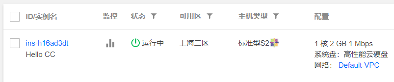

- 使用Xshell提供的家庭/校园免费版本

  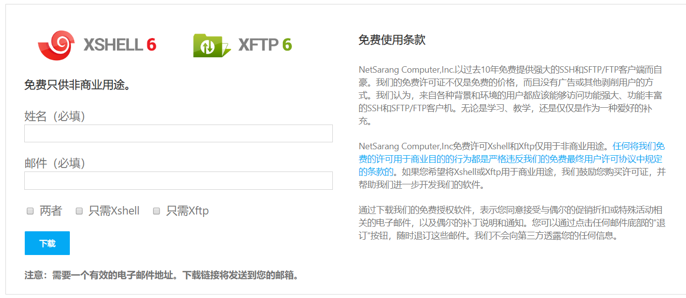

- 使用Xsheel登陆

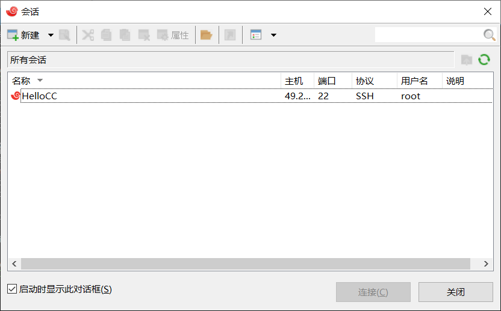

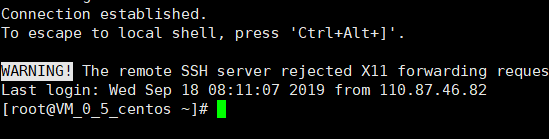

## 创建GitHub项目并在本地同步

### 安装Git并打开界面

- 创建SSH key

  使用ls -al ~/.ssh命令验证是否存在ssh key

  若不存在则使用ssh-keygen -t rsa -b 4096 -C “your_email@example.com”命令通过rsa加密创建密钥

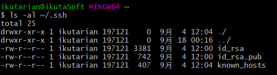

​       随后复制“id_rsa.pub”的内容到GitHub网站的Settings–>SSH and GPG keys中

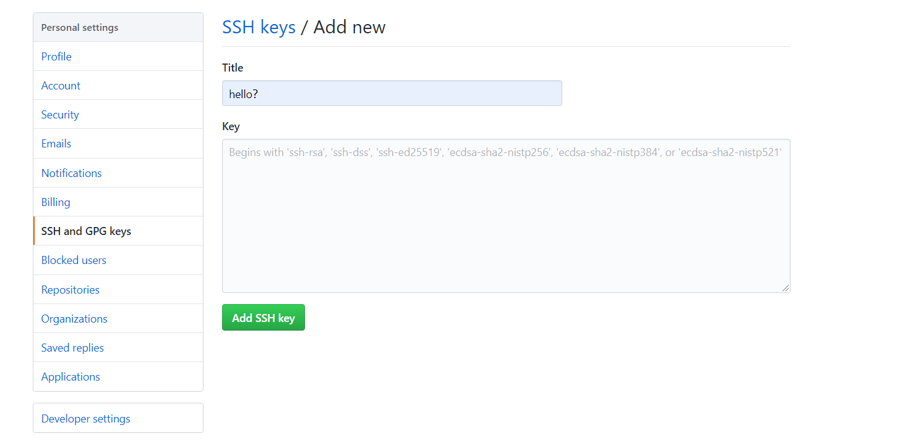

- 检测ssh密钥是否配置成功

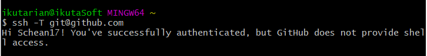

### 创建GitHub项目并在本地进行同步

- 创建本地仓库

  初始化本地文件夹作为一个git仓库，拷贝网站中的项目网址

  添加远程代码仓库的URL，并通过git remote -v命令检验是否成功

  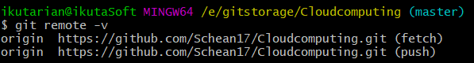

  首先从远程代码仓库拉取数据

  

  新建readme文档并提交文件到本地仓库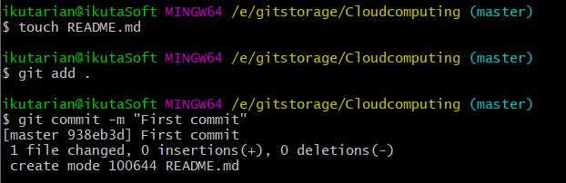

  

​		推送本地更新到远程服务器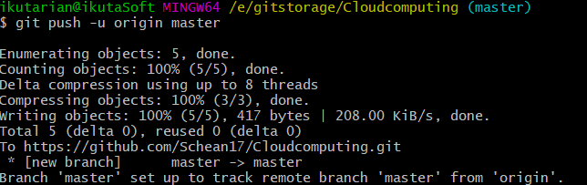

​		

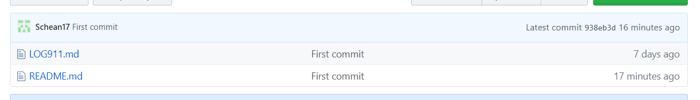

​	

# 本地安装VMware workspace和CentOS

1. 安装VMware，并在阿里云开源镜像站https://opsx.alibaba.com/mirror下下载centos7.6的镜像

   

2. 打开VMware新建虚拟机，按需求配置

3. 进入安装界面选择最小安装并设置root密码

4. 以root用户登陆系统，安装完成

   

