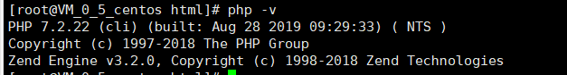
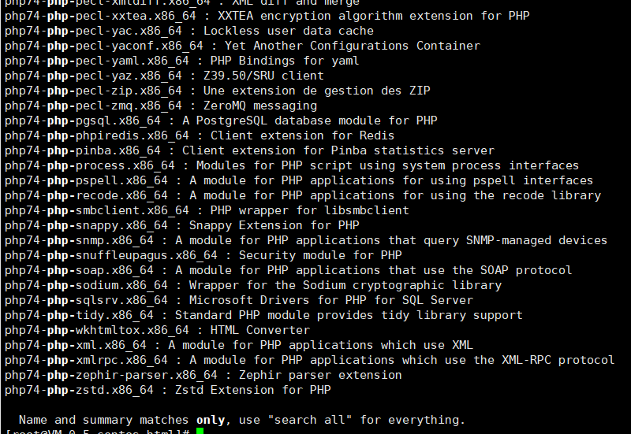
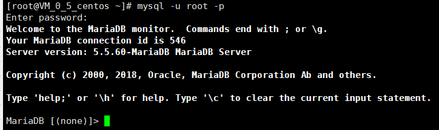
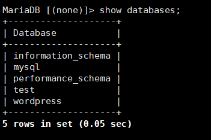
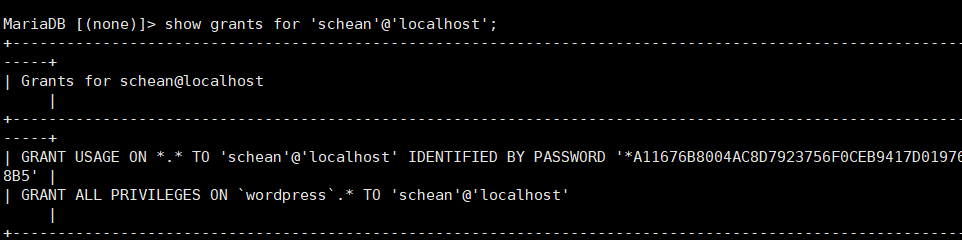
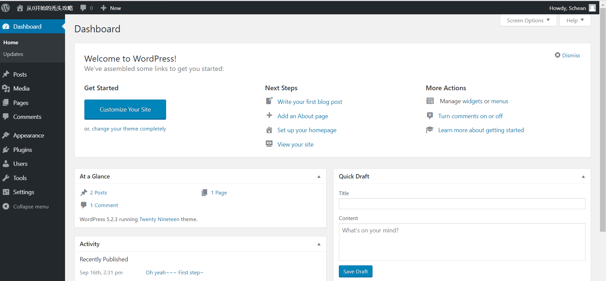

# 在CentOs上配置WordPress


## 1.安装Apache Web服务器

使用yum工具安装：

```
sudo yum install httpd
```

sudo命令获得了root用户的执行权限，因此需要验证用户口令。
安装完成之后，启动Apache Web服务器：

```
sudo systemctl 

start httpd.service
```

测试Apache服务器是否成功运行，找到腾讯云实例的公有IP地址(your_cvm_ip)，在你本地主机的浏览器上输入 http://your_cvm_ip/

若运行正常，将出现如下界面：


## 2.安装MySQL

CentOS 7.2的yum源中并末包含MySQL，需要其他方式手动安装。因此，我们采用MySQL数据库的开源分支MariaDB作为替代。
安装MariaDB：

```
sudo yum install mariadb-server mariadb
```


安装好之后，启动mariadb：

安装好之后，启动mariadb：

```
sudo systemctl start mariadb
```


随后，运行简单的安全脚本以移除潜在的安全风险，启动交互脚本：

随后，运行简单的安全脚本以移除潜在的安全风险，启动交互脚本：

```
sudo mysql_secure_installation
```

设置相应的root访问密码以及相关的设置(都选择Y)。
最后设置开机启动MariaDB：

```
sudo systemctl enable mariadb.service
```


## 3.安装PHP

PHP是一种网页开发语言，能够运行脚本，连接MySQL数据库，并显示动态网页内容。
默认的PHP版本太低（PHP 5.4.16），无法支持最新的WordPress（笔者写作时为5.2.2），因此需要手动安装PHP较新的版本(PHP 7.2)。
PHP 7.x包在许多仓库中都包含，这里我们使用Remi仓库，而Remi仓库依赖于EPEL仓库，因此首先启用这两个仓库

```
sudo yum install epel-release yum-utils
sudo yum install http://rpms.remirepo.net/enterprise/remi-release-7.rpm

```


接着启用PHP 7.2 Remi仓库：

```
sudo yum-config-manager --enable remi-php72
```


安装PHP以及php-mysql

```
sudo yum install php php-mysql
```


查看安装的php版本：

```
php -v
```


安装之后，重启Apache服务器以支持PHP：

安装之后，重启Apache服务器以支持PHP：

```
sudo systemctl restart httpd.service
```


安装PHP模块
为了更好的运行PHP，需要启动PHP附加模块，使用如下命令可以查看可用模块：

安装PHP模块
为了更好的运行PHP，需要启动PHP附加模块，使用如下命令可以查看可用模块：

```
yum search php-
```


部分结果如图所示：



部分结果如图所示：


## 4.测试PHP


## 5.安装WordPress以及完成相关配置

### (1)为WordPress创建一个MySQL数据库

首先以root用户登录MySQL数据库：

```
mysql -u root -p
```

键入之前设置的root用户密码，并按下回车键进入MySQL命令行模式。



首先为WordPress创建一个新的数据库：

```
CREATE DATABASE wordpress;
```

注意：MySQL的语句都以分号结尾。
接着为WordPress创建一个独立的MySQL用户：

```
CREATE USER wordpressuser@localhost IDENTIFIED BY 'password';
```

“wordpressuser”和“password”使用你自定义的用户名和密码。授权给wordpressuser用户访问数据库的权限：

```
GRANT ALL PRIVILEGES ON wordpress.* TO wordpressuser@localhost IDENTIFIED BY 'password';
```


随后刷新MySQL的权限：

```
FLUSH PRIVILEGES;
```

再次检查是否成功完成





最后，退出MySQL的命令行模式：

```
exit
```


### (2)安装WordPress

下载WordPress至当前用户的主目录：

```
cd ~
wget http://wordpress.org/latest.tar.gz
```


wget命令从WordPress官方网站下载最新的WordPress集成压缩包，解压该文件：

```
tar xzvf latest.tar.gz
```

解压之后在主目录下产生一个wordpress文件夹。我们将该文件夹下的内容同步到Apache服务器的根目录下，使得wordpress的内容能够被访问。这里使用rsync命令：

```
sudo rsync -avP ~/wordpress/ /var/www/html/
```

接着在Apache服务器目录下为wordpress创建一个文件夹来保存上传的文件：

```
mkdir /var/www/html/wp-content/uploads
```

对Apache服务器的目录以及wordpress相关文件夹设置访问权限：

```
sudo chown -R apache:apache /var/www/html/*
```

这样Apache Web服务器能够创建、更改WordPress相关文件，同时我们也能够上传文件。

### (3)配置WordPress

大多数的WordPress配置可以通过其Web页面完成，但首先通过命令行连接WordPress和MySQL。
定位到wordpress所在文件夹：

```
cd /var/www/html
```

WordPress的配置依赖于wp-config.php文件，当前该文件夹下并没有该文件，我们通过拷贝wp-config-sample.php文件来生成：

```
cp wp-config-sample.php wp-config.php
```

然后，通过nano超简单文本编辑器来修改配置，主要是MySQL相关配置：

```
nano wp-config.php
```

将文件中的DB_NAME，DB_USER和DB_PASSWORD更改成之前为WordPress创建的数据库的相关信息，这三处信息是当前唯一需要修改的。


### (4)通过Web界面进一步配置WordPress

经过上述的安装和配置，WordPress运行的相关组件已经就绪，接下来通过WordPress提供的Web页面进一步配置。输入你的IP地址或者域名：

http://server_domain_name_or_IP
出现如下界面：

设置网站的标题，用户名和密码以及电子邮件等，点击Install WordPress，弹出确认页面：

点击Log In，弹出登录界面：


输入用户名和密码之后，进入WordPress的控制面板：

